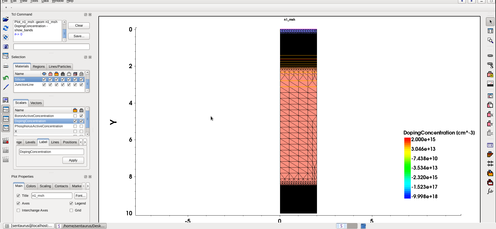
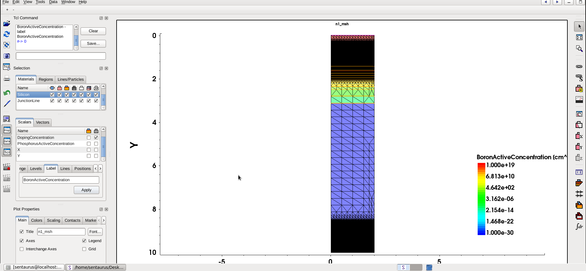
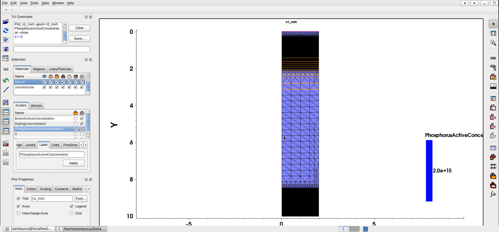
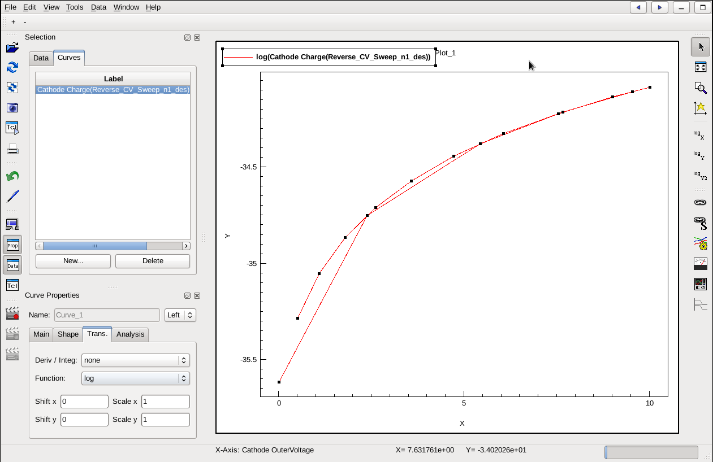

# VLSI Device Modeling of an Advanced Silicon P⁺-N-N⁺ Diode
### A 2D TCAD Structural, Physical, and Electrical Characterization Study using Synopsys Sentaurus

---

## 1. Executive Summary

This repository presents a complete **2D TCAD (Technology Computer-Aided Design)** device modeling and numerical characterization suite for an advanced **Silicon P⁺-N-N⁺ Power Diode**, built entirely on the **Synopsys Sentaurus TCAD** toolchain.

The project spans the full simulation lifecycle of a semiconductor power device: structural generation and doping placement in **Sentaurus Structure Editor (SDE)**, mesh discretization via **SNMESH**, physically rigorous numerical solving in **Sentaurus Device (sdevice)**, and result extraction/plotting in **Sentaurus Visual (svisual)**.

Electrically, the device is characterized across four regimes:

- **Forward-bias DC conduction** (diode turn-on and current rise)
- **Reverse-bias DC leakage and avalanche breakdown**
- **Small-signal junction capacitance (C–V)** under reverse bias
- **Large-signal transient switching**, including diode turn-on and **reverse recovery ($t_{rr}$)**


```text
========================================================================================
                                 TCAD SIMULATION FLOW
  +------------------+    +------------------+    +------------------+    +------------------+
  |    Sentaurus     |    |   SNMESH Mesh    |    | Sentaurus Device |    | Sentaurus Visual |
  | Structure Editor |--->|    Generator     |--->| Numerical Solver |--->|   Data & Plot    |
  |      (SDE)       |    |   (n1_msh.tdr)   |    |    (sdevice)     |    |   Extraction     |
  +------------------+    +------------------+    +------------------+    +------------------+
========================================================================================
```

---

## 2. The Advanced P⁺-N-N⁺ Diode — Device Concept and Governing Equations

A conventional PN diode uses two uniformly doped regions. The **P⁺-N-N⁺ structure** modeled here is a **power/vertical diode architecture**: a heavily doped **P⁺ anode** and a heavily doped **N⁺ cathode** sandwich a lightly doped **N (drift/base) region**. This drift region is the defining feature of a power diode — it is designed to **support the reverse-bias electric field** and block high voltages, while the two heavily doped end regions guarantee low-resistance ohmic contact and efficient carrier injection.

**Built-in potential** of the P⁺N junction:

$$V_{bi} = \frac{kT}{q} \ln\left(\frac{N_a N_d}{n_i^2}\right)$$

where $N_a$ is the P⁺ anode doping, $N_d$ is the N-region background doping, $n_i$ is the intrinsic carrier concentration, $k$ is Boltzmann's constant, $T$ is temperature, and $q$ is the electron charge.

**Depletion width** (one-sided junction approximation, since $N_a \gg N_d$, the depletion region extends almost entirely into the lightly doped N side):

$$W = \sqrt{\frac{2\varepsilon_{si}(V_{bi}+V_R)}{q}\left(\frac{1}{N_a}+\frac{1}{N_d}\right)} \;\approx\; \sqrt{\frac{2\varepsilon_{si}(V_{bi}+V_R)}{qN_d}}$$

**Ideal diode equation** governing the DC I–V behavior:

$$I = I_s \left[ \exp\left(\frac{qV}{nkT}\right) - 1 \right]$$

$I_s$ is the reverse saturation current and $n$ is the ideality factor.

**Peak electric field** at the metallurgical junction (used later to explain avalanche breakdown, Section 7):

$$E_{max} = \frac{qN_d W}{\varepsilon_{si}}$$

Because the drift region is lightly doped, this device also carries **conductivity modulation**: under forward bias, minority carriers are injected deep into the N drift region, temporarily reducing its resistance — this same stored charge is what must be removed during reverse recovery (Section 9–10).

---

## 3. TCAD Tool Flow: SDE → SNMESH → Sentaurus Device → SVisual

The simulation is executed as a single connected pipeline, with each tool consuming the previous tool's output:

| Stage | Tool | Input | Output | Purpose |
|---|---|---|---|---|
| 1 | **Sentaurus Structure Editor (SDE)** | Scheme (`.scm`) commands | Device geometry + doping | Defines the 2D silicon domain, electrodes, and dopant (Gaussian/constant) profiles |
| 2 | **SNMESH** | SDE geometry/doping | `n1_msh.tdr` | Generates an unstructured, doping- and junction-aware adaptive mesh |
| 3 | **Sentaurus Device (sdevice)** | `n1_msh.tdr` + command deck | `n1_des.tdr`, `*.plt` | Solves Poisson + carrier continuity equations self-consistently for every bias/electrical test |
| 4 | **Sentaurus Visual (svisual)** | `.tdr` / `.plt` datasets | Plots (`Results/*.png`) | Extracts and renders mesh, IV, CV, and transient curves |

The three scripts below are the exact SDE, Sentaurus Device, and Sentaurus Visual sources used to generate every result in this repository — structure/mesh, DC I–V, breakdown, C–V, and transient reverse recovery.

📄 **[SDE structure & mesh script](TCAD%20Scripts/sde.txt)** · **[sdevice command file](TCAD%20Scripts/sdevice.txt)** · **[svisual plot script](TCAD%20Scripts/svisual.txt)**

---

## 4. Device Structure

The simulated structure is a 2D vertical diode with the following geometry and doping, as defined in the SDE script:

- **Domain size:** 2 µm (width) × 10 µm (depth) — silicon region `R.Substrate`
- **Electrodes:** `Anode` (top edge, y = 0) and `Cathode` (bottom edge, y = 10 µm)
- **Background (N drift/base) doping:** Phosphorus, constant, **$N_d = 2 \times 10^{15}\ \text{cm}^{-3}$** — this lightly doped region is what gives the device its voltage-blocking capability
- **P⁺ Anode implant:** Gaussian profile, Boron, **peak $N_a = 1 \times 10^{19}\ \text{cm}^{-3}$** at the surface, characteristic depth ≈ 0.8 µm, tailing down to the $2\times10^{15}$ background
- **N⁺ Cathode implant:** Gaussian profile, Phosphorus, **peak $N_d = 1 \times 10^{20}\ \text{cm}^{-3}$**, placed at the bottom ≈ 0.5 µm from the cathode edge, tailing to the same background level

**Mesh refinement strategy** (SNMESH):
- A coarse global mesh (0.5 µm / 0.2 µm max/min element size) covers the bulk drift region
- A **highly refined window around the metallurgical junction** (0.05 µm / 0.01 µm, tightened further to 0.005/0.001 µm in the vertical direction) accurately resolves the steep doping gradient and electric field peak at the P⁺N junction
- A moderately refined window at the **N⁺ cathode** (0.1 µm / 0.02 µm) resolves the second, less critical junction

The doping results are visualized in `Results/DopingConcentration.png` (net/total doping across the device), `Results/BoronActiveConcentration.png` (P⁺ anode Gaussian implant profile), and `Results/PhosphorusActiveConcentration.png` (combined N drift background + N⁺ cathode Gaussian implant). Together these confirm the intended P⁺-N-N⁺ doping asymmetry: a sharp, heavily doped anode spike, a wide lightly doped drift plateau, and a sharp, heavily doped cathode spike.





---

## 5. Physics Models Used

The `Physics` block in the sdevice deck activates a stack of physical models needed for an accurate power-diode simulation:

**a) Doping-dependent mobility** — carrier mobility degrades as ionized-impurity scattering increases with local doping:

$$\mu(N) = \mu_{min} + \frac{\mu_{max}-\mu_{min}}{1+\left(N/N_{ref}\right)^{\alpha}}$$

**b) High-field saturation mobility** — at high electric fields, drift velocity saturates rather than increasing linearly (Canali-type formulation):

$$\mu(E) = \frac{\mu_0}{\left[1+\left(\mu_0 E / v_{sat}\right)^{\beta}\right]^{1/\beta}}$$

**c) Enormal mobility** — accounts for additional mobility degradation from the electric field component *normal* to the Si interface (surface/channel scattering), important near contacts and edges of the mesh.

**d) SRH (Shockley–Read–Hall) recombination**, doping-dependent lifetime — models recombination through deep-level trap states:

$$R_{SRH} = \frac{pn - n_i^2}{\tau_p(n+n_1) + \tau_n(p+p_1)}$$

**e) Auger recombination** — a three-particle, high-carrier-density recombination mechanism, dominant in the heavily doped P⁺ and N⁺ regions:

$$R_{Auger} = \left(C_n n + C_p p\right)\left(pn - n_i^2\right)$$

**f) Avalanche generation — Lackner model** — impact-ionization carrier multiplication, essential for reproducing breakdown:

$$G_{avalanche} = \alpha_n n v_n + \alpha_p p v_p$$

where the ionization coefficients $\alpha_n$, $\alpha_p$ follow the field-dependent **Lackner** expression, which is well suited to modeling breakdown across a wide field range without the low-field over-estimation seen in simpler (Chynoweth-type) models.

**g) Old Slotboom effective intrinsic density (bandgap narrowing)** — at the heavily doped P⁺/N⁺ regions, bandgap narrowing increases the effective intrinsic carrier density:

$$n_{i,eff}^2 = n_i^2 \exp\left(\frac{\Delta E_g}{kT}\right)$$

with $\Delta E_g$ following Slotboom's empirical doping-dependent expression. This is what correctly suppresses excess forward current/leakage that would otherwise be over-predicted in the heavily doped regions.

**h) Thermodynamic model** — solves the lattice heat-flow equation self-consistently with the electrical equations, allowing local Joule heating/cooling to feed back into carrier mobility and recombination rates (relevant to the `Thermode` blocks at 300 K):

$$C_L \frac{\partial T_L}{\partial t} = \nabla\cdot(\kappa \nabla T_L) + H$$

**i) Drift-Diffusion transport** — the fundamental transport equations solved throughout:

$$J_n = q\mu_n n E + qD_n \nabla n$$

$$J_p = q\mu_p p E - qD_p \nabla p$$

coupled self-consistently with Poisson's equation:

$$\nabla\cdot(\varepsilon \nabla \psi) = -q\left(p - n + N_D^+ - N_A^-\right)$$

**j) Transient model** — for the reverse-recovery simulation, the time-dependent continuity equations are solved directly:

$$\frac{\partial n}{\partial t} = \frac{1}{q}\nabla\cdot J_n - R_{net}$$

$$\frac{\partial p}{\partial t} = -\frac{1}{q}\nabla\cdot J_p - R_{net}$$

capturing the finite time required to sweep out (or inject) stored minority charge as the terminal bias is switched — the physical origin of the reverse-recovery transient in Sections 9–10.

---

## 6. Forward-Bias DC Characteristics

`Results/Forward Bias.png` shows the anode current as the anode voltage is swept quasi-statically from 0 V toward 1.5 V, with the cathode grounded.


The plot overlays four separate current components extracted at the Anode contact:

**Anode eCurrent** (electron current) — rises the most gradually of the four curves. Because the anode is the heavily doped P⁺ terminal, it is a minority-carrier (electron) collection point, so the electron contribution builds up slowly as forward bias increases.

**Anode hCurrent** (hole current) — rises steeply and dominates the terminal current almost from the start. This is expected: at a P⁺N junction, hole injection from the heavily doped P⁺ anode into the lightly doped N drift region is the majority injection mechanism, so holes account for most of the current measured at the anode.

**Anode DisplacementCurrent** — stays essentially flat at zero throughout. This is correct for a quasi-stationary DC sweep (Quasistationary in the sdevice deck): displacement current, J_disp = ε·dE/dt, only appears under time-varying fields, and only becomes significant in the transient solves (Sections 9–10).


(Sections 9–10).
Anode TotalCurrent — the sum of the above, and it tracks almost exactly with hCurrent since hole injection dominates. It shows negligible current below roughly 0.6–0.7 V, then rises exponentially once the junction is forward-biased enough to overcome the built-in potential $$V_{bi}$$ — consistent with the ideal diode law:

$$I = I_s\left[\exp\left(\frac{qV}{nkT}\right)-1\right]$$

As the sweep continues toward 1.5 V, both hCurrent and TotalCurrent begin to **roll over into a more gradual, near-linear rise** at the highest currents: this roll-off is the ohmic voltage drop developing across the lightly doped, moderately resistive **N drift region**, and it is the same conductivity-modulated region that stores charge for reverse recovery. The Old Slotboom bandgap-narrowing model keeps this turn-on realistic despite the very heavily doped P⁺/N⁺ end regions.

---

## 7. Reverse-Bias Characteristics and Avalanche Breakdown

`Results/Reverse Bias.png` corresponds to the `Breakdown_IV_` sweep, where the cathode is driven up to a 200 V goal (anode grounded) after the forward branch is stepped back to 0 V.


Across most of the reverse-bias range, current stays extremely low — this is the reverse saturation/leakage regime, dominated by SRH generation in the depleted N drift region. As $V_{cathode}$ approaches the device's breakdown voltage, the curve shows a **sharp, near-vertical rise in reverse current** — the signature of **avalanche multiplication**. This knee is a direct consequence of the **Lackner avalanche model**:

$$G_{avalanche} = \alpha_n n v_n + \alpha_p p v_p$$

As the peak electric field at the P⁺N metallurgical junction, $E_{max} = qN_dW/\varepsilon_{si}$, approaches the critical field for silicon, impact-ionization generation grows super-linearly and dominates the terminal current. The lightly doped $2\times10^{15}\ \text{cm}^{-3}$ N drift region is precisely what allows the device to support this field over a wide depletion width before breakdown occurs, which is the entire design intent of the P⁺-N-N⁺ power-diode architecture.

---

## 8. Reverse C–V Characteristics and Junction Capacitance

`Results/Reverse_CV.png` plots the terminal charge/capacitance response from the `Reverse_CV_Sweep_` solve, as the cathode is stepped from 0 V to 10 V.



The curve shows charge (and hence junction capacitance, $C = dQ/dV$) **decreasing monotonically as reverse bias increases** — the expected behavior for a step-like P⁺N junction, since the depletion width widens with reverse bias:

$$C_j(V_R) = \frac{\varepsilon_{si} A}{W(V_R)}, \qquad W(V_R) = \sqrt{\frac{2\varepsilon_{si}(V_{bi}+V_R)}{qN_d}}$$

Because $N_a \gg N_d$, the junction capacitance is governed almost entirely by the **lightly doped N-side depletion width**, which is why the capacitance falls off relatively gently over the 0–10 V window rather than collapsing sharply — a lightly doped drift region depletes more gradually than a symmetric or heavily doped junction would. This depletion (junction) capacitance is the same capacitance that must be charged/discharged during fast switching, linking this section directly to the transient behavior in Sections 9–10.

---

## 9. Initial Transient Response and Dynamic Resistance

`Results/Initial Transient Recovery.png` corresponds to the `Transient_RR_Init_` step, where the anode is quasi-statically ramped to 1.0 V forward bias (cathode grounded) to establish a forward-conduction operating point before the fast transient switch.


As the anode voltage ramps up, the anode current rises and asymptotically settles as the diode reaches its forward steady state — this establishes the **stored minority-carrier charge** in the N drift region (via conductivity modulation, Section 2/6) that will later need to be extracted during reverse recovery. This step is also where the diode's **dynamic (small-signal) resistance** can be read off the curve:

$$r_d = \frac{dV}{dI} \approx \frac{nkT}{qI_{forward}}$$

As the forward current increases toward its steady-state value, $r_d$ **decreases** — the diode presents progressively less incremental resistance to further increases in current, which is exactly the inverse of the exponential I–V relationship discussed in Section 6. This falling dynamic resistance, combined with the accumulated stored charge, sets the initial conditions for the reverse-recovery transient in Section 10.

---

## 10. Final Transient Reverse Recovery Response

`Results/Final Transient Reverse Recovery Response.png` is the `Transient_` solve: starting from the forward operating point established in Section 9, the terminal condition is switched and the diode's true time-domain response is solved from 0 to 100 ns ($InitialTime=0$, $FinalTime=100\text{ ns}$).


The waveform shows the classic **reverse recovery** signature:
1. **Storage phase** — immediately after switching, the anode current reverses direction and rises in magnitude, because the minority charge stored in the N drift region during forward conduction (Section 9) must first be swept out before the junction can support reverse voltage.
2. **Peak reverse recovery current ($I_{rr}$)** — the point of maximum reverse current, reached once the excess stored charge at the junction edge has been depleted to zero.
3. **Fall/recovery phase** — the reverse current decays back toward the steady-state reverse leakage level (Section 7) as the depletion region re-establishes itself, with the fall rate governed by carrier lifetimes (SRH/Auger, Section 5) and the drift region's transit time.

The total time from switching to (near-)full recovery is the **reverse recovery time, $t_{rr}$**, and the area under the reverse-current spike represents the **stored/recovered charge, $Q_{rr}$**:

$$Q_{rr} = \int_{0}^{t_{rr}} I_{reverse}(t)\, dt$$

both of which are the key figures of merit for a power diode's switching-loss performance, and both are a direct, simulated consequence of the lightly doped drift-region design that also gives this device its high breakdown voltage (Section 7).

---


## 👨‍💻 Abishek S
- **Email:** xia2020.abisheks@gmail.com
- **LinkedIn:** [linkedin.com/in/abishek-s-848564258](https://www.linkedin.com/in/abishek-s-848564258)

---

## License

This project is licensed under the terms of the [MIT License](LICENSE).
